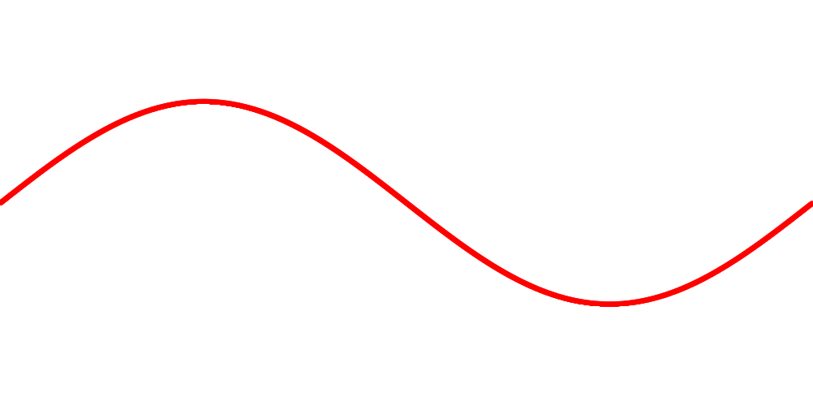
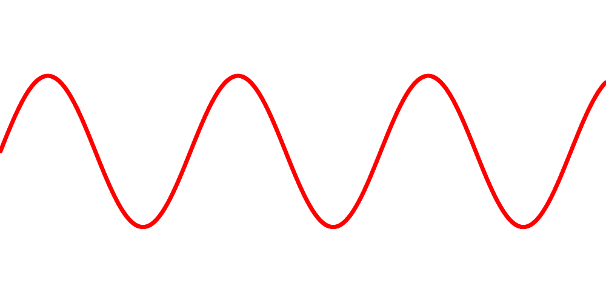
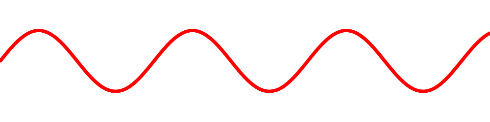

# cpplot
plotter for the cpp language.
work in progress.

function rendering with customizable curve thickness is working.

you can change the displayed section of cartesian space with one method call.

it is also possible to change image resolution with one method call.

