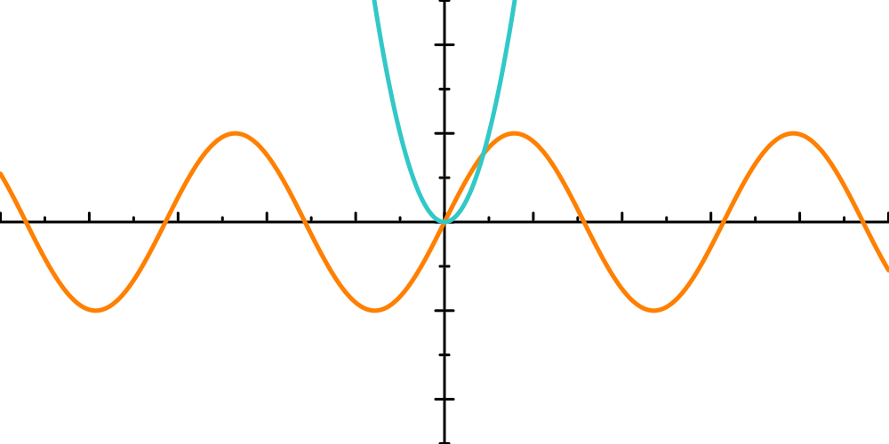

# cpplot
plotter for the cpp language.
work in progress.

Function rendering with customizable curve thickness is working.

You can change the displayed section of cartesian space with one method call.

It is also possible to change image resolution with one method call.

Axis system is working. You can choose if the axis will be at a relative position with respect to the image or at a fixed position in R2 space. Various options for customization are available, including tick offset ,tick size, step size and more. If those arguments are not initialized by the user, the program chooses a suitable value on its own.

